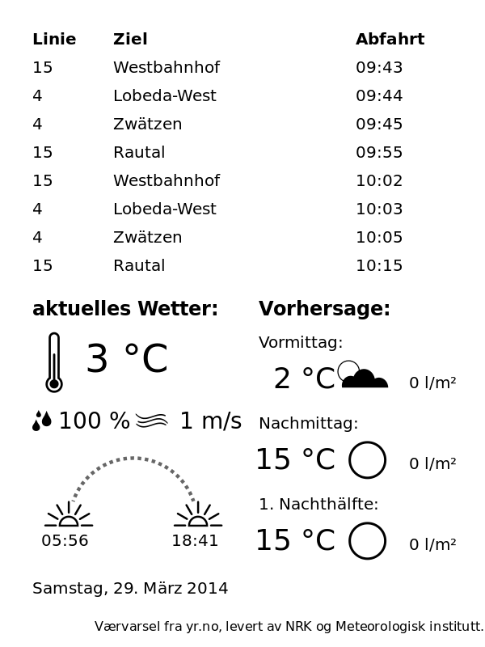

This is a weather data display inspired by mpetroff (https://github.com/mpetroff/kindle-weather-display, http://www.mpetroff.net/archives/2012/09/14/kindle-weather-display/).
Additional information is displayed. In this case current departure of trams and busses.

On the server the following packages are required:  
* Python 2.7  
* lxm for Python (http://lxml.de/)  
* pngcrush  
* rsvg  

In the Kindle:  
* Jailbreak  
* USB Networking (for trouble shooting)  
* Kual 2 (for Launcher and convenient USBNet)  

License: MIT for Code and CC-BY-SA for Artwork

